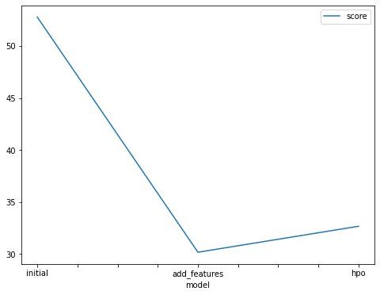
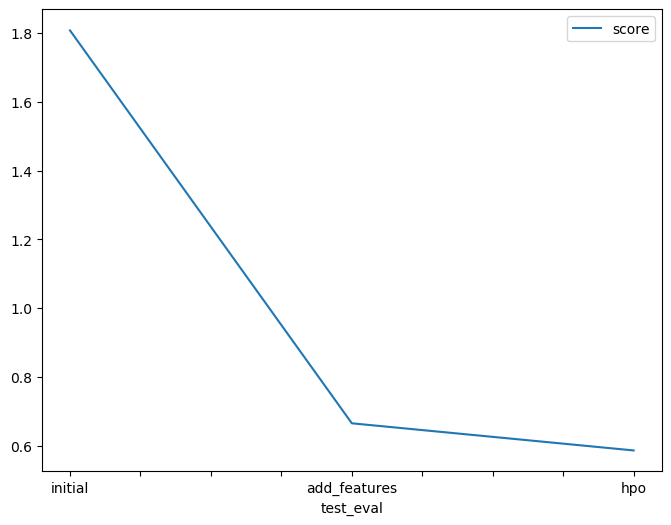

# Report: Predict Bike Sharing Demand with AutoGluon Solution
#### SRIDEVI SUBRAMANIAN

## Initial Training
### What did you realize when you tried to submit your predictions? What changes were needed to the output of the predictor to submit your results?
There were some negative values in the predictions. These had to be set to 0.

### What was the top ranked model that performed?
The top ranked model for the 3 scenarios were as follows
1) Initial - WeightedEnsemble_L3
2) New Feature - WeightedEnsemble_L3
3) HPO - WeightedEnsemble_L2
In all cases the weighted ensemble with either 3 layer or 2 layer stacking performed best.
Among the 3 scenarios, in my limited experimentation, the New Feature model performed best. 

## Exploratory data analysis and feature creation
### What did the exploratory analysis find and how did you add additional features?
There was not much EDA done on this project. The only EDA cell was to plot histogram of the features.
I plotted a heatmap to understand the correlation between the features and included the target to get an idea 
of correlation with the target.
- temp and atemp have a high degree of correlation which is not unexpected. Might be interesting to try by dropping say 
the temp feature.
- Again not unexpected but weather and humidity have moderate correlation
- interesting that the target variable has no correlation to the weather

Another heatmap was plotted after adding date_hour and date_month.
- date_month had a high degree of correlation with season
- date_hour had a higher correlation with the target
- From this I decided to drop date_month and used date_hour as a new feature

### How much better did your model preform after adding additional features and why do you think that is?
- It is never easy to explain how the model learns.
- From the correlation heatmap I can only surmise explicitly separating the hour of day as a column helped the 
  model to better predict the count.

## Hyper parameter tuning
### How much better did your model preform after trying different hyper parameters?
- With HPO the model performed about 8% on the submission score. 
- On the validation score it performed slightly poorly making me think it was underfitted.
- HPO requires many more trials on different parameters of each model. I attempted only a modest set 
since I wanted to conserve time used on AWS to be sure I can complete the course staying within the limit.

### If you were given more time with this dataset, where do you think you would spend more time?
- Feature Engineering and HPO

### Create a table with the models you ran, the hyperparameters modified, and the kaggle score.
    "model": ["initial", "add_features", "hpo"],
    "time": [600, 600, 1500],
    "GBM_num_boost_round": [100, 100, 150],
    "RF_n_estimators": [100, 100, 350],
    "CAT_iterators": [500, 500, 10100],
    "XT_n_estimators": [100, 100, 350],
    "score": [1.80808, 0.66523, 0.58628]

### Create a line plot showing the top model score for the three (or more) training runs during the project.

TODO: Replace the image below with your own.

### Create a line plot showing the top kaggle score for the three (or more) prediction submissions during the project.

TODO: Replace the image below with your own.

## Summary
TODO: Add your explanation
AWS AutoGluon was used to train regression models to predict the count of bikes on a test data set.
The algorithm was used to train the initial data set, data set with a new feature added and, lastly, with tuning of hyperparameters.
The test scores showed continuous improvement with new feature and hyperparameter optimization.